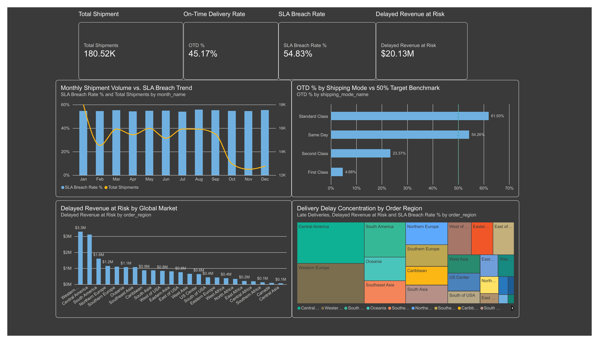

# Logistics Delivery & SLA Performance Cockpit

A business intelligence and supply chain operations analytics project analyzing on-time delivery (OTD %), carrier SLA compliance, and regional fulfillment bottlenecks across 180,519 global shipments.

Public Dataset Source: Kaggle - DataCo Smart Supply Chain for Big Data Analysis
https://www.kaggle.com/datasets/shashwatwork/dataco-smart-supply-chain-for-big-data-analysis

## 1. Executive BI Cockpit Overview



## 2. Key Business Insights

1. Network Delivery Reliability:
   - Evaluated 180,519 shipments across global transit corridors from 2015 to 2017.
   - Overall On-Time Delivery (OTD %) is 45.17%, with a network SLA Breach Rate of 54.83% (98,977 late deliveries).
   - Total Delayed Revenue at Risk reaches $20.13M out of $36.78M in gross merchandise value.

2. Carrier Shipping Mode Performance Breakdown:
   - Standard Class: Dominant volume (107,752 orders, 59.7%) and highest reliability at 61.93% OTD.
   - Same Day: Achieves 54.26% OTD across 9,737 rapid dispatches.
   - Second Class: High failure rate with 76.63% SLA breaches ($5.48M delayed revenue at risk).
   - First Class: Critical operational failure with a 95.32% breach rate, indicating scheduled expectations (1 day) are severely disconnected from actual multi-day sorting and transit capabilities.

3. Regional Bottleneck Concentration:
   - The top 2 bottleneck regions drive over 30,600 delayed shipments:
     - Central America (LATAM): 15,518 late shipments (54.75% breach rate, $3.11M delayed value).
     - Western Europe (Europe): 15,140 late shipments (55.85% breach rate, $3.29M delayed value).

## 3. Core Metrics Summary

- Total Shipments Evaluated: 180,519
- On-Time Delivery (OTD %): 45.17% (benchmark >= 50.00%)
- SLA Breach Rate: 54.83% (benchmark <= 50.00%)
- Total Late Deliveries: 98,977
- Total Gross Sales: $36,784,735.01
- Delayed Revenue at Risk: $20,126,395.27
- Average Actual Transit Days: 3.50 Days (benchmark <= 3.00 Days)

## 4. Star Schema Data Model

The analytical data model follows an optimized Kimball Star Schema for slicing in Power BI:

- Fact Table:
  - fact_shipments: Granular order items, scheduled vs actual shipping days, delay duration, binary late flags, and sales value.
- Dimension Tables:
  - dim_shipping_modes: Carrier modes (Standard Class, Second Class, First Class, Same Day) and SLA standards.
  - dim_regions: Geographic mapping of 23 global regions across 5 macro markets (LATAM, Europe, Pacific Asia, USCA, Africa).
  - dim_calendar: Conformed date hierarchy (Year, Quarter, Month, Month Name) spanning 2015-2018.

## 5. SQL Implementation Snippets

### Monthly SLA Breach and OTD Trend (sql/01_sla_breach_rate.sql)
```sql
SELECT 
    c.year,
    c.month,
    c.month_name,
    COUNT(f.shipment_id) AS total_shipments,
    SUM(f.is_on_time) AS on_time_shipments,
    SUM(f.is_late) AS late_shipments,
    ROUND(100.0 * SUM(f.is_on_time) / COUNT(f.shipment_id), 2) AS otd_pct,
    ROUND(100.0 * SUM(f.is_late) / COUNT(f.shipment_id), 2) AS breach_rate_pct,
    ROUND(SUM(f.sales), 2) AS total_revenue,
    ROUND(SUM(CASE WHEN f.is_late = 1 THEN f.sales ELSE 0 END), 2) AS delayed_revenue_at_risk
FROM fact_shipments f
JOIN dim_calendar c ON f.order_date = c.date_id
WHERE c.year BETWEEN 2015 AND 2017
GROUP BY c.year, c.month, c.month_name
ORDER BY c.year, c.month;
```

### Carrier Mode Scorecard (sql/02_carrier_mode_scorecard.sql)
```sql
SELECT 
    m.shipping_mode_name,
    COUNT(f.shipment_id) AS total_shipments,
    ROUND(100.0 * SUM(f.is_on_time) / COUNT(f.shipment_id), 2) AS otd_pct,
    ROUND(100.0 * SUM(f.is_late) / COUNT(f.shipment_id), 2) AS breach_rate_pct,
    ROUND(SUM(CASE WHEN f.is_late = 1 THEN f.sales ELSE 0 END), 2) AS delayed_revenue_at_risk,
    RANK() OVER (ORDER BY ROUND(100.0 * SUM(f.is_on_time) / COUNT(f.shipment_id), 2) DESC) AS otd_rank
FROM dim_shipping_modes m
JOIN fact_shipments f ON m.mode_id = f.mode_id
GROUP BY m.mode_id, m.shipping_mode_name
ORDER BY otd_rank;
```

## 6. Power BI Assets & Deliverables

- Visual Dashboard: output/dashboard_overview.png
- Power BI Workbook: powerbi/logistics_sla_cockpit.pbix
- DAX Formula Library: powerbi/measures.dax (12 explicit measures covering OTD %, SLA Breach Rate, Delayed Revenue at Risk, and Target Variances)
- Data Model Specification: powerbi/star_schema_model.md
- Data Exports: powerbi/data_exports/ (fact_shipments.csv, dim_shipping_modes.csv, dim_regions.csv, dim_calendar.csv)
- SQL Analysis Scripts: sql/01_sla_breach_rate.sql, sql/02_carrier_mode_scorecard.sql, sql/03_regional_bottlenecks.sql
- Database: data/logistics.db (Indexed SQLite star schema with 180,519 rows)
